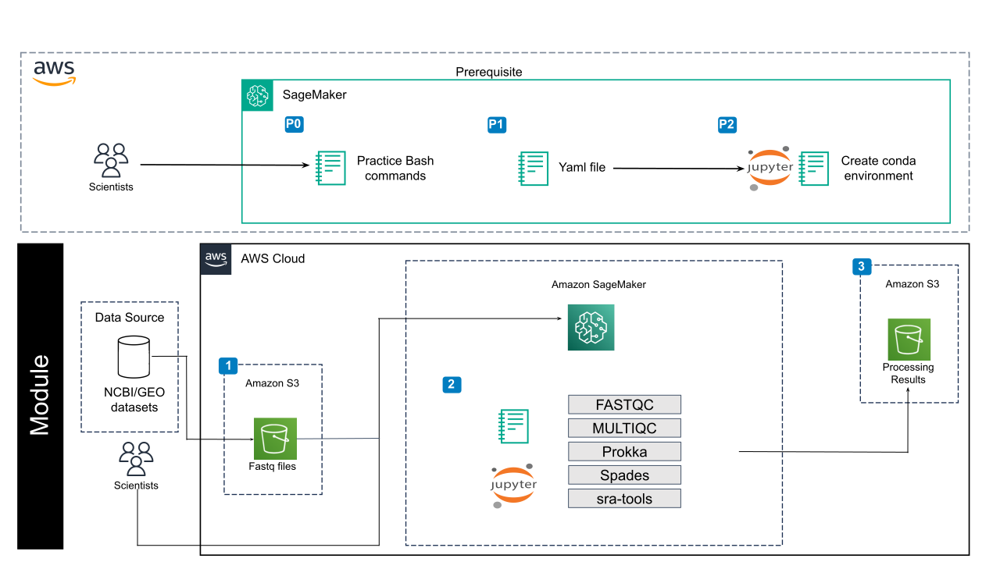

# Intro to Bioinformatics on the Command Line for AWS

## Overview of Page Contents

+ [Overview](#overview)
+ [Getting Started](#getting-started)
+ [Software Requirements](#software-requirements)
+ [Architecture Design](#architecture-design)
  
## **Overview**

This module teaches you how to interact with genomics files using the terminal interface in the cloud. Each lesson builds upon the skills and BASH code from the previous lesson using Jupyter notebooks. By the end of the module you should be familiar with the format of many genomics files, installing bioinformatics tools that analyze genomics data, and have an understanding of the process of building complex BASH code to work with genomics files.

## **Getting Started**

Included here are several submodules or tutorials in the form of Jupyter notebooks. The purpose of these submodules is to help users familiarize themselves with the cloud computing environment in the specific context of working with genomics data and software packages to analyze genomics data. These tutorials accomplish this by going step-by-step introducing users to the cloud environment, the terminal interface, the BASH coding language, genomics file formats, the conda software package manager, and methods for mitigating common coding errors. These lessons build familiarity with the terminal environment and set users up to begin working with their own datasets in the terminal environment.

### Creating a notebook instance

- Follow the steps highlighted [here](https://github.com/NIGMS/NIGMS-Sandbox/blob/main/docs/HowToCreateAWSSagemakerNotebooks.md) to create a new notebook instance in Amazon SageMaker. Follow steps and be especially careful to enable idle shutdown as highlighted. For this module, in [step 4](https://github.com/NIGMS/NIGMS-Sandbox/blob/main/docs/HowToCreateAWSSagemakerNotebooks.md) in the "Notebook instance type" tab, select ml.m5.xlarge from the dropdown box, and set volume size to 20 GB. Select conda_python3 kernel in [step 8](https://github.com/NIGMS/NIGMS-Sandbox/blob/main/docs/HowToCreateAWSSagemakerNotebooks.md).

- You will need to download the tutorial files from GitHub. The easiest way to do this would be to clone the repository from NIGMS into your Amazon SageMaker notebook. To clone this repository, use the Git symbole on left menu and then insert the link `https://github.com/NIGMS/Fundamentals-of-Bioinformatics.git` as it illustrated in [step 7](https://github.com/NIGMS/NIGMS-Sandbox/blob/main/docs/HowToCreateAWSSagemakerNotebooks.md). Please make sure you only enter the link for the repository that you want to clone. There are other bioinformatics related learning modules available in the [NIGMS Repository](https://github.com/NIGMS). This will download our tutorial files into a folder called `Introduction-to-Data-Science-for-Biology`.

**IMPORTANT NOTE** 

Make sure that after you are done with the module, close the tab that appeared when you clicked **OPEN JUPYTERLAB**, then check the box next to the name of the notebook you created in [step 3](https://github.com/NIGMS/NIGMS-Sandbox/blob/main/docs/HowToCreateAWSSagemakerNotebooks.md). Then click on **STOP** at the top of the Workbench menu. Wait and make sure that the icon next to your notebook is grayed out.

## **Software Requirements**

All software needed for this module will be installed in the **Software management** lesson using the `env.yml` file included in this repository. Additionally, you will need access to a Jupyter Environment. Some notebooks will require access to the AWS SageMaker environment. 

You can install all necessary requirements using the instructions in `env.yml`, but they will generally look like this:

```
name: test_env channels:

bioconda dependencies:
python= 3.9
ipykernel
fastqc
multiqc
```

## **Architecture Design**



As seen in the image above, we will download sequence files from the AWS S3 bucket to our SageMaker virtual machine. We will practice running BASH commands using the sequence files in the bucket, as well as get practice downloading sequence data from the SRA. Using the Conda package manager we will install and use FastQC, MultiQC, SRA tools, Spades, and Prokka to analyze data from the SRA. Lastly we will create a new AWS S3 bucket, and copy our analyzed data to the new bucket. We explain our submodules that execute these processes here:

+ Submodule 1, **Introduction to Terminal** introduces the Jupyter notebook format, the terminal window, the syntax of the BASH coding language, and the architecture behind cloud computing. 
+ Submodule 2, **Introduction to Cloud Computing** teaches you how to navigate through a terminal environment to access computational data, here we download all of the data to your Jupyter notebook instance from the AWS S3 bucket used for this module. 
+ Submodule 3, **Genomics File Formats** introduces three common genomics file formats as well as many bash commands for interacting with these file types in the terminal environment. If you would like to complete this module over two days this lesson is an excellent stopping point.
+ Submodule 4, **Beyond Basic BASH** begins with a reminder of all the BASH commands covered in earlier lessons and combine complex commands with a loop and BASH scripting to iterate over several files with a single command. 
+ Submodule 5, **Software Management** uses the Conda package manager to create and install environments where software can be installed. 
+ Submodule 6, **Putting It All Together** leverages all of the skills learned in earlier lessons to download data from the SRA, create a Conda environment for genome assembly and annotation, check the quality, assemble, and annotate a genome. Then create an AWS S3 bucket and write a finalized file set to the AWS S3 bucket. 
+ Submodule 7, **Error Mitigation** provides strategies for mitigating common coding errors.

## Bedrock (Optional)

Generative AI is available for this tutorial in the form of Bedrock if you would like to use it. To run it, please reference submodule 5, or run the following code within a submodule notebook after [requesting access](https://github.com/STRIDES/NIHCloudLabAWS/blob/main/notebooks/GenAI/AWS_Bedrock_Intro.ipynb) to Llama 3 8B Instruct. 

```!pip install -q ipywidgets
import sys
import os
util_path = os.path.join(os.getcwd(), 'util')
if util_path not in sys.path:
    sys.path.append(util_path)

# Import the display_widgets function from your Python file
from genai import display_widgets

# Call the function to display the widgets
display_widgets()
