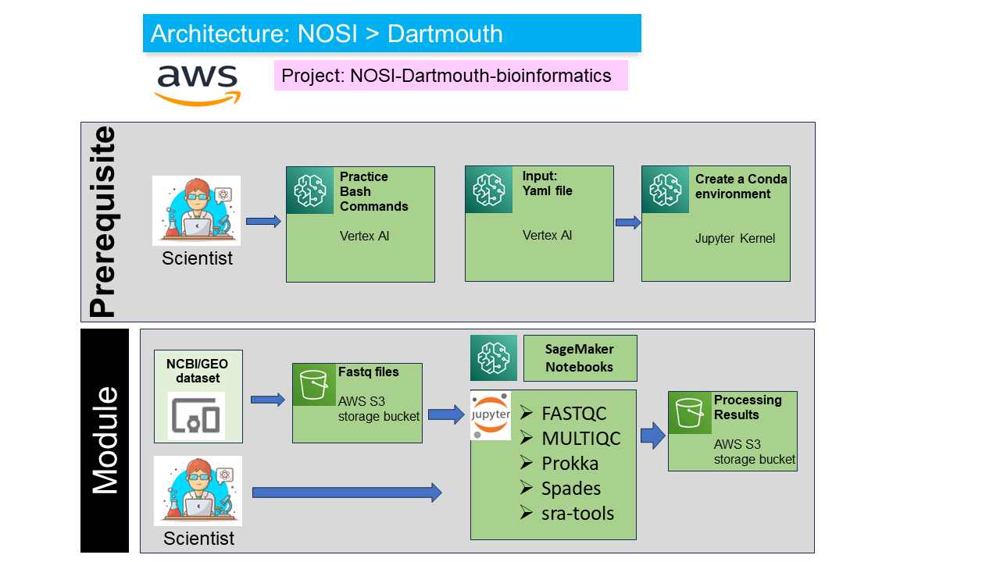

## Overview of Page Contents

+ [Getting Started](#getting-started)
+ [Overview](#overview)
+ [Software Requirements](#software-requirements)
+ [Workflow Diagrams](#workflow-diagrams)

## **Getting Started**
This README contains information on running the modules on Amazon Web Services (AWS). For background information on the biological use case, data sets, and learning objectives, refer to the [overall README file](https://github.com/NIGMS/Fundamentals-of-Bioinformatics/blob/Ross_readmes/README.md) for the entire module.

Users should reference NIH Cloud Lab README (link needed for AWS documentation) for additional technical information on working with AWS for completing this module.

### Creating a user managed notebook 

Follow the steps highlighted [here](https://github.com/NIGMS/NIGMS-Sandbox/blob/main/docs/HowToCreateAWSSagemakerNotebooks.md) to create a new user-managed notebook in AWS SageMaker. For this module you should select Linux 2 and Python 3 in the Environment. In the Notebook instance type tab, select ml.m5.xlarge from the dropdown box. It is **important to shut down** the kernel at the end of your work to avoid getting charged.

To use our module, open a new Terminal window from your new notebook instance and clone this repo using `git clone https://github.com/NIGMS/Fundamentals-of-Bioinformatics/AWS.git`. Navigate to the directory for this project. You will then see the notebooks in your environment.

## **Workflow Diagrams**

As seen in the image above, we will download sequence files from the AWS S3 bucket to our SageMaker virtual machine. We will practice running BASH commands using the sequence files in the bucket, as well as get practice downloading sequence data from the SRA. Using the Conda package manager we will install and use FastQC, MultiQC, Sra-tools, Spades, and Prokka to analyze data from the SRA. Lastly we will create a new AWS S3 bucket, and copy our analyzed data to the new bucket.
