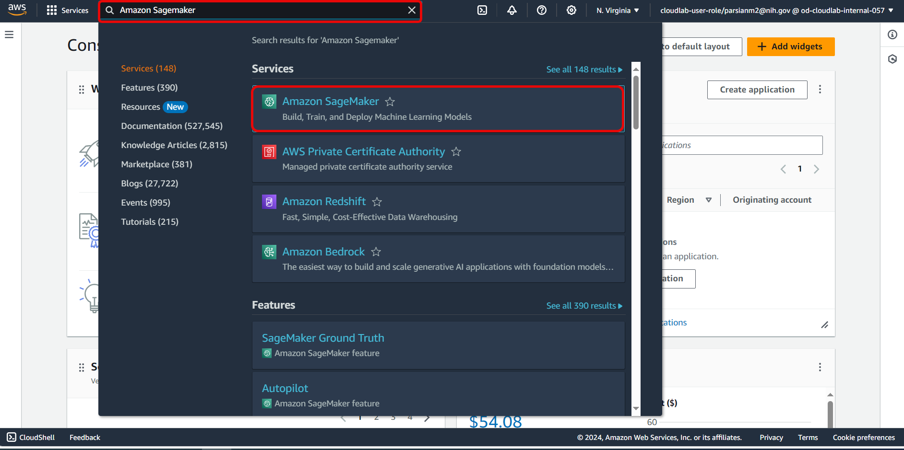
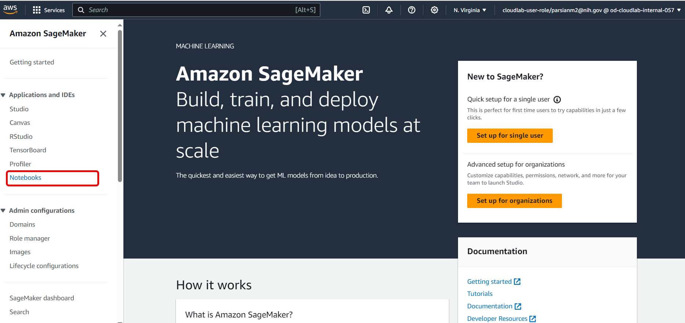
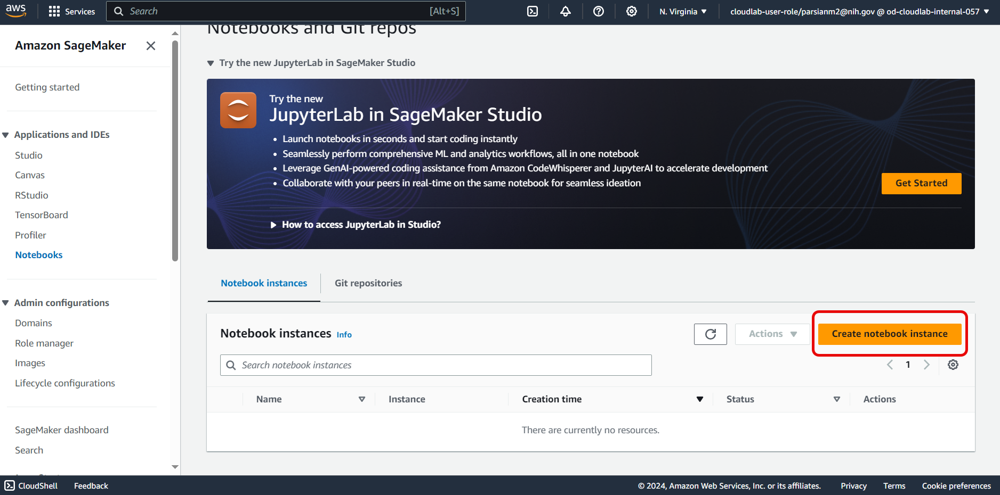
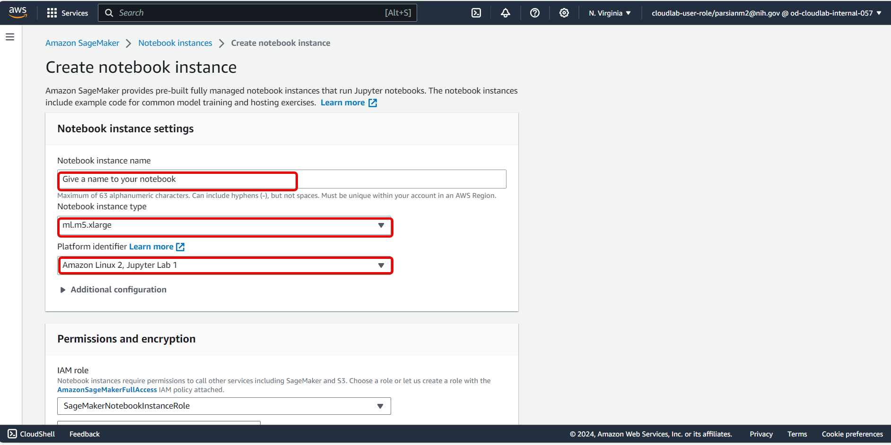
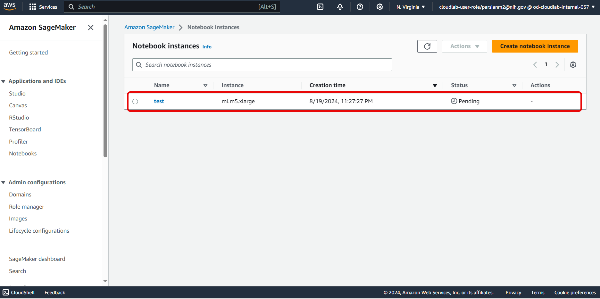
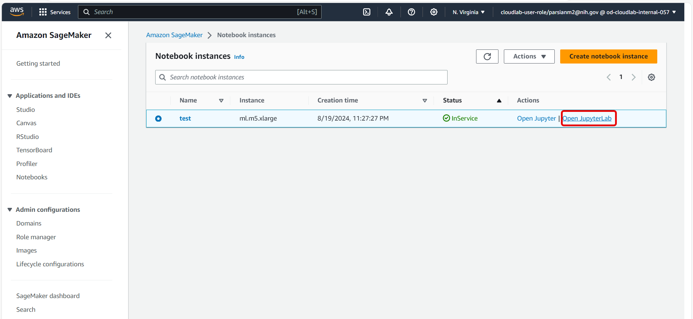
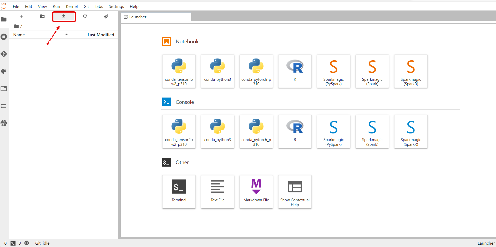
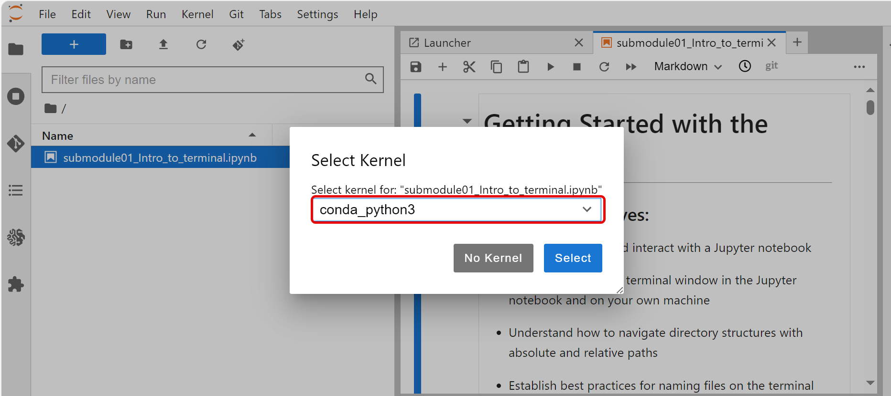
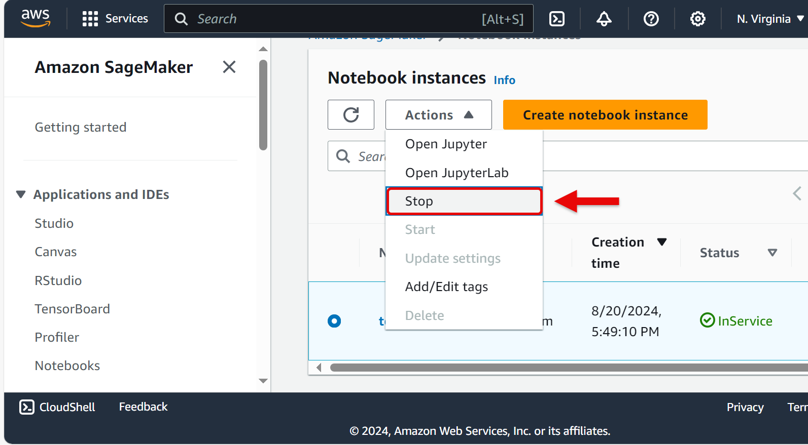

# Using SageMaker Notebooks

AWS offers different types of Notebook instances: SageMaker Studio, SageMaker Notebook Instances, and SageMaker Studio Lab. SageMaker Notebook Instances offer the most flexibility in terms of installing local software via conda/mamba or launching from custom containers. [SageMaker Studio](https://docs.aws.amazon.com/sagemaker/latest/dg/studio.html) and [SageMaker Studio Lab](https://aws.amazon.com/sagemaker/studio-lab/) allow for 'on the fly' machine resizing and notebook scheduling, as well as not worrying about resource availability, but they run in a managed environment and offer less flexibility for installing custom software. Most machine-learning related software are pre-installed, but these can be hard to use for a lot of bioinformatic tasks where you need to install CLI tools with conda.

### Set up a SageMaker Notebook Instance

1. In AWS console, type **Amazon SageMaker** in search bar and click it:

  

2. On the left side bar click **Notebooks**:

  

3. Click **Create notebook instance**:

  

4. Give a name to your notebook. Choose **ml.m5.xlarge** as notebook instance type and Amazon Linux 2 as platform identifier:

    
   
5. It will take about 5 minutes, your notebook instance to get ready:

    
   
6. **Open Jupyter Lab**:

    

7. Upload your jupyter notebook

  

8. Select the kernel:

  

9. **IMPORTANT**: **Stop** the kernel at end of your work to avoid getting charged.

    