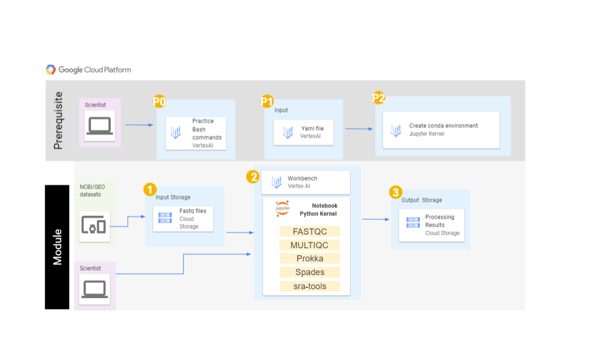

## Overview of Page Contents

+ [Getting Started](#getting-started)
+ [Overview](#overview)
+ [Software Requirements](#software-requirements)
+ [Workflow Diagrams](#workflow-diagrams)

## **Getting Started**

This module will cost you about $2.00 to run end to end on GCP, assuming you shutdown and delete all resources upon completion.

This README contains information on running the modules on Google Cloud Platform. For background information on the biological use case, data sets, and learning objectives, refer to the [overall README file](https://github.com/NIGMS/Fundamentals-of-Bioinformatics/README.md) for the entire module.

Users should reference [NIH Cloud Lab README](https://github.com/STRIDES/NIHCloudLabGCP) for additional technical information on working with GCP for completing this module.

### Creating a user managed notebook 

Follow the steps highlighted [here](https://github.com/STRIDES/NIHCloudLabGCP/blob/main/docs/vertexai.md) to create a new user-managed notebook in Vertex AI. Follow steps 1-8 and be especially careful to enable idle shutdown as highlighted in step 7. For this module you should select Debian 11 and Python 3 in the Environment tab in step 5. In step 6 in the Machine type tab, select n1-standard-4 from the dropdown box.

To use our module, open a new Terminal window from your new notebook instance and clone this repo using `git clone https://github.com/NIGMS/Fundamentals-of-Bioinformatics/GoogleCloud.git`. Navigate to the directory for this project. You will then see the notebooks in your environment.

Before you begin navigating the submodules you will need to enable extensions in the Jupyter notebook. To do this you can click on the puzzle piece icon  on the left most menu (down the side of the Jupyter notebook) and click on the red button that says **Enable**.  Some notebooks will require access to the GCP Vertex AI environment. 

## **Workflow Diagrams**

As seen in the image above, we will download sequence files from the Google Cloud Storage bucket to our Vertex AI virtual machine. We will practice running BASH commands using the sequence files in the bucket, as well as get practice downloading sequence data from the SRA. Using the Conda package manager we will install and use FastQC, MultiQC, Sra-tools, Spades, and Prokka to analyze data from the SRA. Lastly we will create a new Google bucket, and copy our analyzed data to the new storage bucket.
