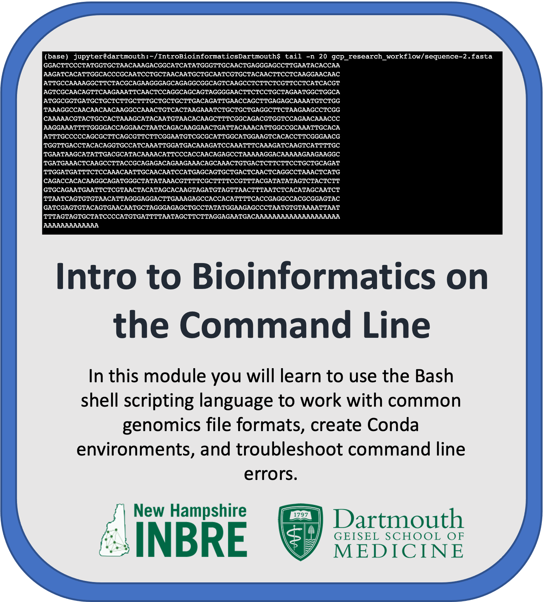

# Dartmouth College Bioinformatics for Beginners
---------------------------------

This module introduces you to the [Bash shell scripting language](https://en.wikipedia.org/wiki/Bash_(Unix_shell)), working with common genomics file formats, and working within the terminal environment. In addition to the overview given in this README you will find 6 submodules in the forms of Jupyter notebooks that teach you different components of working with genomics data in the cloud. This module can be run on either [Google Cloud Platform (GCP)](https://github.com/NIGMS/Fundamentals-of-Bioinformatics/tree/main/GoogleCloud/) or [Amazon Web Services (AWS)](https://github.com/NIGMS/Fundamentals-of-Bioinformatics/tree/main/AWS/)

Watch this [Introduction Video](https://www.youtube.com/watch?v=VaZedZhjXrU&list=PLXaEJPtnQ4w7Vu7vqWbttBjUGrPp4Qa7b&index=1) to learn more about the module.

## Overview of Page Contents

+ [Learning Objectives](#learning_objectives)
+ [Workflow](#workflow)
+ [Data](#data)
+ [Troubleshooting](#troubleshooting)
+ [Funding](#funding)
+ [License for Data](#license-for-data)

## Learning Objectives
+ Gain familiarity with the Linux command line
+ Understand basic concepts of cloud computing
+ Understand the structure of common bioinformatics files
+ Use the Linux command line to summarize information from bioinformatics data files
+ Install bioinformatics software using Conda on the Linux command line
+ Run a simple bioinformatics workflow on the Linux command line
+ Troubleshoot common command line errors

## Workflow

We will download sequence files from the cloud storage bucket. We will practice running BASH commands using the sequence files in the bucket, as well as get practice downloading sequence data from the SRA. Using the Conda package manager we will install and use FastQC, MultiQC, Sra-tools, Spades, and Prokka to analyze data from the SRA. Lastly we will create a new storage bucket, and copy our analyzed data to the new bucket. We explain our submodules that execute these processes here:

+ Submodule 1, **Introduction to Terminal** introduces the Jupyter notebook format, the terminal window, the syntax of the BASH coding language, and the architecture behind cloud computing. 
+ Submodule 2, **Introduction to Cloud Computing** teaches you how to navigate through a terminal environment to access computational data, here we download all of the data to your Jupyter notebook instance from the Google bucket used for this module. 
+ Submodule 3, **Genomics File Formats** introduces three common genomics file formats as well as many bash commands for interacting with these file types in the terminal environment. If you would like to complete this module over two days this lesson is an excellent stopping point.
+ Submodule 4, **Beyond Basic BASH** begins with a reminder of all the BASH commands covered in earlier lessons and combine complex commands with a loop and BASH scripting to iterate over several files with a single command. 
+ Submodule 5, **Software Management** uses the Conda package manager to create and install environments where software can be installed. 
+ Submodule 6, **Putting It All Together** leverages all of the skills learned in earlier lessons to download data from the SRA, create a Conda environment for genome assembly and annotation, check the quality, assemble, and annotate a genome. Then create a storage bucket and write a finalized file set to the  bucket. 
+ Submodule 7, **Error Mitigation** provides strategies for mitigating common coding errors. 

## **Data**

The fasta files used in these lessons were pulled from NCBI using the accession number NC_045512.2 for the Severe acute respiratory syndrome coronavirus 2 isolate Wuhan-Hu-1, complete genome and the associated annotation file (GFF file). The fasta file containing the S11 ribosomal protein sequences from several proteobacteria was originally generated for **Shakya et al., 2017**.

The fastq files used in the Genomics file formats lesson were downloaded from the SRA database using accession number SRP033351. This RNA-seq dateset is described in **Himes et al, 2014**. This study investigates the mechanism by which glucocorticoids, a major treatment used in asthma care, prevent inflammation of airway smooth muscle cells (ASM). We subsequently downsized these datasets to streamline the tutorials and stored them in an AWS S3 Bucket. 

The fastq files downloaded from the SRA in submodule 6 **Putting It All Together** are downloaded from the SRA database using accession number SRR18435413. This sample was sequenced as part of a surveillance effort for SARS CoV2 infections in western New Hampshire. 

## **Troubleshooting**

Most of the errors that you might encounter are discussed in submodule 7 **Error mitigation**, however there are some additional errors you may run into that are not discussed in that lesson.

If your code is not being interpreted in the **Jupyter Notebook** as you would expect it to, you should ensure that you are specifying the BASH language within the code chunk. This can be done by writing `%%bash` at the top of the code chunk OR proceeding each command with `!`. Do not use both of these methods, select one and stick with it.

If your code is not being interpreted in the **terminal window** as you would expect, you should ensure you are not specifying the BASH language. The terminal by default expects that commands will be in BASH and you should not copy the `%bash` or `!` that proceed code chunks in the notebook into the terminal. 

If you're not seeing the kernel named __Python [conda env:root]__ you should ensure that the file `jupyter_config.json` is installed in the correct location. If this file exists in the right place you can try refreshing your notebook and giving the notebook a couple minutes to catch up. 

If you're trying to access software that you installed with a conda environment and you're getting a warning that the software does not exist, check that you have the conda environment loaded. In the **Jupyter Notebook** you should see the name of the conda environment in the top right corner of the module, for example *Python [conda env:test_env]*. In the **terminal window** you should see the name of the conda environment in parentheses proceeding the prompt, for example (test_env). 

## **Funding**

This resource was supported with funds from NIH grant P20GM130454 and NIH grant 3P20GM103506.

## **License for Data**

Text and materials are licensed under a Creative Commons CC-BY-NC-SA license. The license allows you to copy, remix and redistribute any of our publicly available materials, under the condition that you attribute the work (details in the license) and do not make profits from it. More information is available [here](https://tilburgsciencehub.com/about/).

This work is licensed under a [Creative Commons Attribution-NonCommercial-ShareAlike 4.0 International License](http://creativecommons.org/licenses/by-nc-sa/4.0/)
